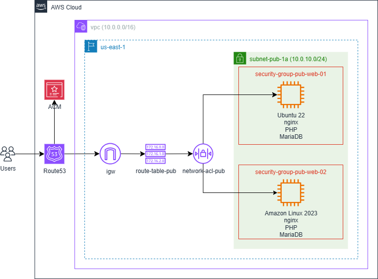

# Ansible Playbooks and Terraform Scripts to Create a LEMP Stack on AWS
The Ansible Playbooks and Terraform scripts in this repository create a LEMP (Linux-Nginx-MariaDB-PHP) stack on AWS. PHP and SQL files are included that create a database and web pages for a fully-functional sample web app with a Certbot SSL/TLS certificate. A GitHub Actions workflow is used to create the AWS infrastructure and apply the Ansible scripts.

Shown below is an architectural diagram of the resources created by the `/terraform/lemp.tfvars` and `/ansible/main.yaml` files, which create two instances, with sample web apps hosted on lemp-01.russetleaf.com and lemp-02.russetleaf.com. The russetleaf.com domain is simply a placeholder, and a functional user-provided domain must be used to successfully deploy the servers, as documented in the [Usage](#Usage) section below.



Before customizing and launching the script, review the resources that will be created, as some resources may not be free tier eligible. Please refer to the [Amazon Pricing](https://aws.amazon.com/pricing/) page for specific regional pricing.  

## Terraform Modules Overview
The root module [main.tf](./main.tf) calls the child modules described below, sending values from the root module .tfvars file and various module outputs.

### `networking` Module
Creates an AWS network infrastructure consisting of a VPC, internet gateway (IGW), NAT gateways, public and private subnets, route tables for each subnet, network access control lists (NACL), and security groups.

### `ec2` Module
Deploys AWS EC2 instances from images listed in datasources.tf, runs an AWS User Data script to apply security measures, and uploads public keys to enable access to each instance.

### `ansible` Module 
Creates an Ansible inventory file with the IP address of each EC2 instance and an Ansible host_vars file for each instance.

### `route53` Module 
Generates an AWS ACM certificate and Route 53 domain verification and website DNS records.

## AWS User Data Bash Scripts Overview
The AWS User Data Bash script installs and configures the security-related software packages described below. Please note the applicable distribution-specific notes.

|Security Measure|Ubuntu 22|Amazon Linux 2023|
|--------|---------|------|
|Automatic security updates|unattended-upgrades|dnf-automatic|
|SSH user with sudo permissions|ssh_ubuntu|ssh_al|
|sshd_config updates to increase security|-|-|
|Firewall to limit ports to 80, 443, and custom SSH|UFW|nftables|
|Linux Security Modules|AppArmor|SELinux|
|Fail2ban (with SSH jail)|-|-|

## Ansible Roles Overview
The `main.yaml` playbook calls the following roles to create the LEMP stack on each instance:

### `base` Role
Installs system updates based on value of the Ansible fact, "ansible_os_family."

### `selinux` Role
Deploys a custom SELinux policy to RHEL-based servers that provides the necessary permissions for nginx to run within the SELinux `httpd_t` domain.

### `database` Role
Installs the MariaDB database packages and runs SQL scripts. 

### `web_server` Role
Installs nginx web server and Certbot packages, copies files to the web server's root directory, and creates the Let's Encrypt challenges to obtain the domain certificate. 

### `php` Role
Installs the required PHP packages. 

## GitHub Actions Workflows Overview
The GitHub Actions Workflows listed below perform the CI/CD pipeline functions required to lint code, create infrastructure, and destroy infrastructure.

### `create_aws_infra.yaml`
Workflow that creates the AWS infrastructure by first running the Terraform scripts, then applying the Ansible Playbook to configure the EC2 instances. Configured for manual triggering via the `workflow_dispatch` event trigger.

### `destroy_aws_infra.yaml`
Workflow that destroys the AWS infrastructure. Configured for manual triggering via the `workflow_dispatch` event trigger.

### `lint.yaml`
Workflow that runs TFLint on the Terraform code. Configured to trigger on pushes to `main`.

## Getting Started

### Dependencies

+ AWS account
+ IAM user with permissions to create the AWS resources described above
+ GitHub CLI installed (if triggering GitHub Actions Workflows via CLI)

### Installation
To install the scripts, fork the [lemp-aws-ansible-terraform](.) repository.

## Usage
Follow the steps outlined below to configure GitHub Actions to run the Terraform and Ansible scripts.

### Step 1. Create the SSH Key Pair and Copy the Public Key to the Repo
On standard Linux distributions with OpenSSH installed, the command below will create an SSH key pair of type Ed25519 in the location ~/.ssh/id_ed25519_lemp.

```bash
ssh-keygen -f ~/.ssh/id_ed25519_lemp -t ed25519
```

The public key must be copied to the repository location referenced in the .tfvars file, specifically `/terraform/modules/ec2/public_key`. To use a different key type or location, update the variables file accordingly.

### Step 2. Configure Terraform Backend
The root `backend.tf` file uses an S3 backend to store state files and purposely includes placeholder values for the backend attributes, which are read from the `backend.cnf` file for non-sensitive values and GitHub Secrets for the S3 bucket name. Modify the values in `backend.cnf` as necessary.

To configure the S3 bucket to store Terraform state data, versioning should be enabled and certain permissions must be assigned to the bucket. Please review the Terraform Documentation for specific [instructions](https://developer.hashicorp.com/terraform/language/backend/s3).

### Step 3. Customize the .tfvars File
The settings for the AWS networking and EC2 resources are contained in a .tfvars file, which is passed to Terraform at runtime. This file must be customized before provisioning resources with Terraform.

While most of the variables correspond to standard AWS Terraform module attributes, there are some custom variables that require specific attention. In particular, please note the following variables:

+ Project Variables
  + project: Name of the project
  + env: Environment, e.g. Dev, Test, Prod
+ EC2 Module
  + public_key: The repository location of the SSH public key.
  + ami: Reference to the Amazon Machine Image. The module's datasources.tf file contains two possible AMIs, Ubuntu 22 (ubuntu_22) or Amazon Linux 2023 (amazon_linux_2023).
  + http_tokens: Two values are valid: optional/required. Following best security practices, "required" should be used, which requires the use of Instance Metadata Service Version 2 (IMDSv2).
  + ssh_ip: The SSH IPv4 address that will be allowed by OpenSSH, Fail2ban, and the instance firewall. This value must correspond with the SSH IPv4 address allowed by the Security Groups and NACLs. The value is currently set to "0.0.0.0/0" but for increased security should be modified throughout to a more specific address.
  + ssh_port: The SSH port that will be allowed by OpenSSH, Fail2ban, and the instance firewall. This value must correspond with the SSH port allowed by the Security Groups and NACLs. 
  + domain_name: The domain name for the nginx server block, which must be a subdomain of the domain managed by the AWS Hosted Zone.
  + certbot_email: Valid email address, which is required by Certbot to issue the Let's Encrypt SSL/TLS certificate.

### Step 4. Configure Ansible (Optional)
The `ansible.cfg` file includes entries that point to the locations of the inventory file and roles directory. Changes are required only if the exiting Ansible repository directory structure is modified.

### Step 5. Copy PHP and SQL Files to `/files` Directory (Optional)

The `/files` directory in the repository is populated with the PHP, HTML, and SQL files required for each instance, assuming the instance object keys in the .tfvars file are named `web-01` and `web-02`. If the instances are named differently, rename the directories to reflect the instance object keys.

### Step 6. Configure GitHub Actions Secrets
GitHub Actions Secrets ensure that sensitive values are not stored in repository code. Please create the Secrets listed below, which are required by the GitHub Actions Workflows:

+ AWS_ACCESS_KEY_ID: Must be associated with an IAM User with permissions to create the resources generated by the Terraform scripts.
+ AWS_SECRET_ACCESS_KEY: The secret access key for the access key id.
+ AWS_ZONE_ID: Valid AWS Route53 Zone Id for a Hosted Zone.
+ DATABASE_ADMIN_PASSWORD: Password for the MariaDB admin user. Follow best practices to create a strong password.
+ DATABASE_ADMIN_USERNAME: Username of the MariaDB admin user, which must meet MySQL/MariaDB requirements (letters, numbers, and underscores).
+ DATABASE_NAME: Name of the database. Use naming best practices, e.g. underscores instead of spaces.
+ PHP_PASSWORD: Password of the PHP user. Follow best practices to create a strong password.
+ PHP_USERNAME: Username of the PHP user. This user has read access to the database, and must meet MySQL/MariaDB requirements (letters, numbers, and underscores).
+ SSH_PRIVATE_KEY: The private key corresponding to the public key that is uploaded to the server.
+ TF_STATE_S3_BUCKET: Amazon S3 bucket that will store Terraform state data.

### Step 7. Create Infrastructure Using GitHub Actions
The command below will initiate the `create_aws_infra.yaml` GitHub Actions Workflow, which runs the Terraform scripts and applies the Ansible Playbook to configure the EC2 instances.
 
```bash
gh workflow run create_aws_infra.yaml
```

### Step 8. Access the EC2 Instance via SSH
To access the Ubuntu 22 instance, enter the command below in the shell. Change the username to ssh_al if using Amazon Linux 2023. The IP address of each EC2 instance is displayed as an output of the Terraform script, identified by the value `public_ip`. The Terraform outputs can be viewed in the GitHub Actions log for the `create_aws_infra.yaml` Workflow.

```bash
ssh -i ~/.ssh/aws-test-env-ed25519 -p 2222 ssh_ubuntu@[public_ip]
```

### Step 9. Confirm Security Measures Have Been Applied
Run the distribution-specific commands below to confirm the security measures implemented by the AWS User Data script have been applied correctly. Use `sudo` for each command.

|Security Measure|Ubuntu 22|Amazon Linux 2023|
|--------|---------|------|
|Automatic security updates|`systemctl status unattended-upgrades`|`systemctl status dnf-automatic`|
|View sshd_config updates|`sshd -T`|`sshd -T`|
|Show firewall rules|`ufw status`|`nft list ruleset`|
|Linux Security Modules|`aa-status`|`sestatus`|
|Check Fail2ban jails|`fail2ban-client status`|`fail2ban-client status`|

### Step 10. Confirm Certbot Auto-Renewals
By default, the Ubuntu 22 APT install of Certbot creates a systemd timer to check the status of the Let's Encrypt certificate and auto-renew if it is set to expire within 30 days. Instantiating the Certbot auto-renewal on Amazon Linux 2023, however, requires the creation of a custom systemd service and timer, both of which are generated by the Ansible `web_server` role. On both Ubuntu 22 and Amazon Linux 2023, viewing the Let's Encrypt logs after the timer's first run will confirm whether the auto-renewals have been configured successfully:

```bash
sudo tail /var/log/letsencrypt/letsencrypt.log
```

To confirm the certificate will be renewed properly, the following commands simulate the Certbot renewal process:
 
+ Ubuntu 22: `sudo certbot renew --dry-run`
+ AL2023: `sudo /opt/certbot/bin/certbot renew --dry-run`

### Step 11. Confirm Website Works
Using a browser, for each instance, navigate to the website identified by the `domain_name` variable and confirm the sample web page is displayed using SSL/TLS. 

### Step 12. Destroy Infrastructure Using GitHub Actions
The command below will initiate the `destroy_aws_infra.yaml` GitHub Actions Workflow, which destroys the AWS infrastructure.
 
```bash
gh workflow run destroy_aws_infra.yaml
```

## License
Licensed under the [GNU General Public License v3.0](./LICENSE).
